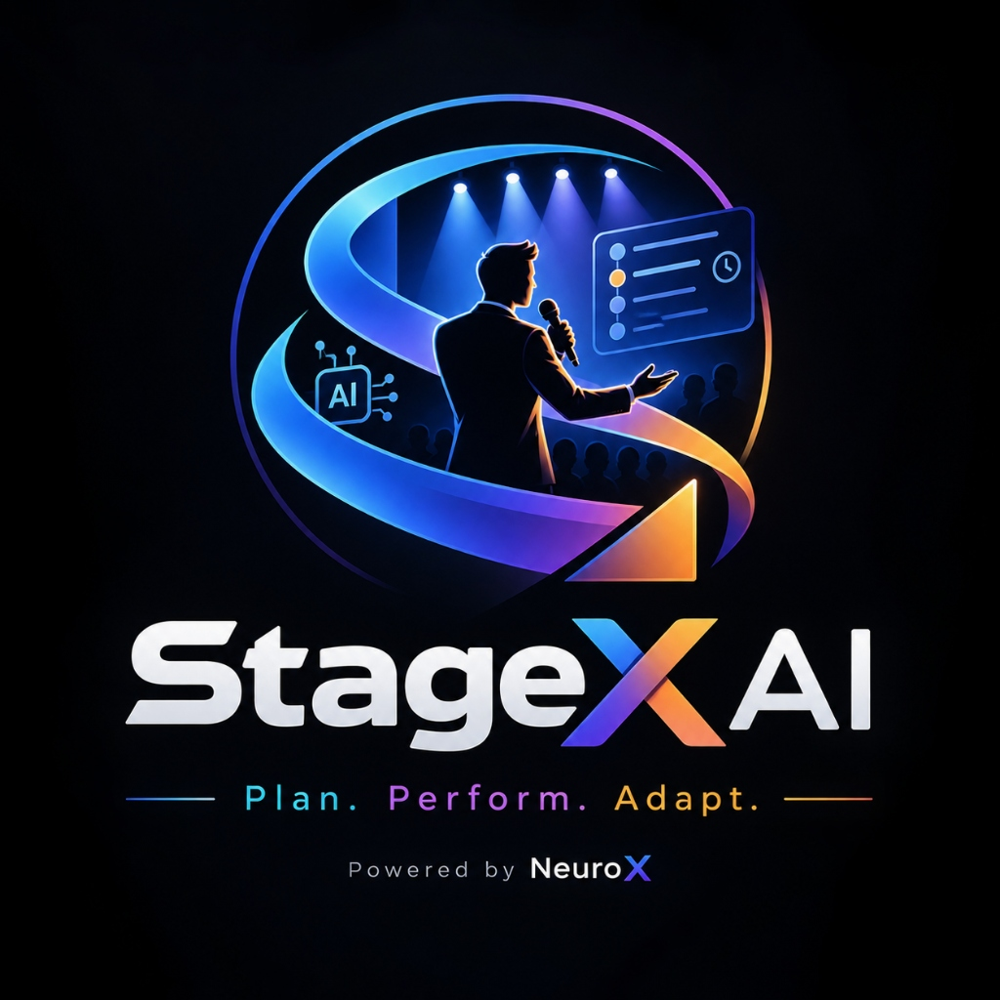

  

<strong>StageX AI</strong> · Plan. Perform. Adapt.

Powered by NeuroX · Bit N Build '26 · PS-5

🎯 Executive Overview

StageX AI is an intelligent live stage operations platform for event
organizers, stage coordinators, and anchors.

It combines:

Plan --- Create events, manage speakers, and build structured
agendas.

Perform --- Monitor live sessions, countdowns, overtime, and
stage activity.

Adapt --- Handle delays, emergencies, schedule changes, and
multi-day timelines.

Assist --- Use AI for event planning, scripts, announcements,
operational assistance, and invitation generation.

The system is designed around real user-created data rather than fake or
randomly generated dashboard information.

⚡ Core Features

Event Management

Create, edit, and delete events

Same-day, overnight, and multi-day events

Full date/time based scheduling

Event-specific speakers and sessions

Multiple events can exist simultaneously

Multiple events can be live without automatically deactivating each
other

User-specific data isolation

Agenda & Sessions

Create and manage sessions

Assign speakers

Session types and statuses

Reorder sessions

Planned and actual timings

Start, complete, and skip controls

Full timestamp support across midnight and multiple days

Live Stage

Current and upcoming session monitoring

Countdown based on actual timestamps

Live elapsed timers

Overtime detection

Session state tracking

Event-specific live operations

Support for multiple simultaneous live events

Dynamic Delay Engine

StageX AI recalculates the schedule when delays or overruns occur.

+5 / +10 / custom delays

Buffer absorption

Future-session shifting

Overnight and multi-day delay propagation

Fixed-time conflict protection

Delay history

Activity logging

Firestore persistence

Emergency Management

Supports operational incidents such as:

Speaker delayed

Microphone issue

Projector issue

Technical problem

Unexpected break

Venue change

Custom emergency

Emergency activity is recorded against the relevant event.

AI Copilot

The Global Copilot is not restricted to one selected event.

It can understand natural-language requests and work with event context,
including:

Event planning

Event creation from rough descriptions

Event-related questions

Event updates and queries

Operational assistance

AI-generated content

Script generation

Announcements

Conversation history

AI failures are isolated from the core stage-management system.

Scripts

A dedicated Scripts area stores event-specific AI-generated scripts.

Supported script use cases include:

Opening

Speaker introduction

Session transition

Emergency filler

Announcement

Closing / vote of thanks

Scripts can be opened in the Teleprompter and downloaded.

Teleprompter

Large readable script display

Script selection using stable script IDs

Auto-scroll

Play / pause / reset

Font and alignment controls where available

Full-screen / near-full-screen presentation

English, Gujarati, Hindi, and bilingual content support

Invitations

A dedicated Invitations area stores event-specific invitation designs.

AI-assisted invitation generation

Professional visual invitation layouts

Editable invitation content

Theme and artwork support

Saved invitation repository

PNG export

PDF export

Print-only invitation output

Multilingual content

Structured invitation data is kept separate from visual artwork so the
invitation remains editable.

Analytics

Analytics are derived from actual event activity.

Metrics can include:

Total sessions

Completed sessions

Delayed sessions

Total delay

Maximum delay

Emergency events

AI generation activity

Schedule deviation

Activity history

Deterministic event health calculations where applicable

No random statistics are injected into the dashboard.

🤖 AI Architecture

AI requests are handled through the server-side AI API route.

Security

Gemini API keys must never be exposed in:

Client-side JavaScript

Browser storage

GitHub

Public source files

Use environment variables for server-side credentials.

Multi-Key / Multi-Model Resilience

The architecture supports multiple Gemini API keys and configurable
supported models.

Example environment structure:

GEMINI_API_KEY_1=
GEMINI_API_KEY_2=
GEMINI_API_KEY_3=

GEMINI_MODEL_PRIMARY=
GEMINI_MODEL_FALLBACK_1=
GEMINI_MODEL_FALLBACK_2=

The application should use controlled fallback and bounded retries for
retryable failures such as temporary availability or quota/rate-limit
conditions.

AI failures should return a clear user-facing error and must not crash
the entire application.

Image Generation

Where the configured image-generation provider/model supports it:

Global Copilot can request generated visuals.

Invitation AI can generate invitation artwork/background/decorative
visuals.

Generated artwork remains separate from editable invitation data.

Image generation failure must not destroy the invitation or
conversation state.

🔐 Firebase Authentication

StageX AI uses Firebase Authentication for user accounts.

Supported authentication:

Email/password

Google Sign-In

Auth state persistence

Logout

User-specific application access

Each user's application data is isolated using the authenticated
Firebase UID.

☁️ Cloud Firestore

Cloud Firestore is the persistent cloud data layer for StageX AI.

Data Architecture

users/{userId}
└── events/{eventId}
    ├── speakers/{speakerId}
    ├── sessions/{sessionId}
    ├── delays/{delayId}
    ├── emergencies/{emergencyId}
    ├── activityLogs/{activityLogId}
    ├── aiRecords/{aiRecordId}
    ├── aiConversations/{conversationId}
    ├── scripts/{scriptId}
    └── invitations/{invitationId}

User Isolation

Firestore security rules restrict data access using the authenticated
Firebase UID.

Users should only be able to access their own application data.

Persistence

The application uses Zustand for client-side application state while
Firestore provides cloud persistence.

Local storage may be retained as a resilience/cache layer where
implemented, but Firestore is the cloud persistence layer.

🏗️ Technology Stack

Frontend

Next.js

React

TypeScript

Tailwind CSS

Lucide React

Recharts

State Management

Zustand

Authentication & Database

Firebase Authentication

Cloud Firestore

AI

Google Gemini API

Server-side AI route

Testing

Vitest

Deployment

GitHub

Vercel

📁 Project Structure

Bit-N-Built/
├── app/
│   ├── agenda/
│   ├── ai/
│   ├── analytics/
│   ├── api/
│   ├── dashboard/
│   ├── events/
│   ├── invitations/
│   ├── live-stage/
│   ├── login/
│   ├── scripts/
│   ├── settings/
│   ├── speakers/
│   └── teleprompter/
│
├── components/
│   ├── agenda/
│   ├── ai/
│   ├── events/
│   ├── live-stage/
│   ├── navigation/
│   ├── speakers/
│   ├── teleprompter/
│   └── ui/
│
├── contexts/
│   └── auth-context.tsx
│
├── lib/
│   ├── firestore/
│   ├── ai-context.ts
│   ├── analytics-engine.ts
│   ├── date-utils.ts
│   ├── file-processor.ts
│   ├── firebase.ts
│   ├── image-generator.ts
│   ├── live-engine.ts
│   ├── schedule-engine.ts
│   ├── storage.ts
│   └── validation.ts
│
├── store/
│   └── event-store.ts
│
├── types/
│   └── index.ts
│
├── tests/
│
├── public/
│   └── brand/
│       ├── stagex-logo.png
│       └── favicon.png
│
├── firestore.rules
├── firestore.indexes.json
├── firebase.json
├── STAGEX_AI_PRD.md
├── README.md
└── package.json

🔑 Environment Configuration

Create .env.local in the project root for local development.

Never commit .env.local or real secrets to GitHub.

Example:

NEXT_PUBLIC_FIREBASE_API_KEY=
NEXT_PUBLIC_FIREBASE_AUTH_DOMAIN=
NEXT_PUBLIC_FIREBASE_PROJECT_ID=
NEXT_PUBLIC_FIREBASE_STORAGE_BUCKET=
NEXT_PUBLIC_FIREBASE_MESSAGING_SENDER_ID=
NEXT_PUBLIC_FIREBASE_APP_ID=

GEMINI_API_KEY_1=
GEMINI_API_KEY_2=
GEMINI_API_KEY_3=

GEMINI_MODEL_PRIMARY=
GEMINI_MODEL_FALLBACK_1=
GEMINI_MODEL_FALLBACK_2=

Use .env.example as the safe template.

🚀 Getting Started

Prerequisites

Node.js 18+

Node.js 20+ recommended

npm 9+

Installation

git clone <repository-url>
cd Bit-N-Built
npm install

Environment

Create .env.local and add the required Firebase and Gemini
configuration.

Development

npm run dev

Open the local URL displayed by Next.js.

🧪 Testing & Validation

Run the following before deployment:

npm run lint
npm test
npm run build

The automated test suite covers application logic, Firebase/Firestore
services, AI-related workflows, date handling, analytics, and
architecture-related functionality.

🔄 Main User Flow

Login
  ↓
Dashboard
  ↓
Create / Select Event
  ↓
Add Speakers
  ↓
Build Agenda
  ↓
Launch Live Stage
  ↓
Monitor Countdown
  ↓
Handle Delay / Emergency
  ↓
Generate AI Script / Announcement
  ↓
Open Teleprompter
  ↓
Complete Sessions
  ↓
Review Analytics
  ↓
Firestore Persistence

🧠 AI Global Copilot Flow

User
 ↓
Global Copilot
 ↓
Natural-language request
 ↓
Context / intent detection
 ↓
Event lookup or event-plan generation
 ↓
AI response / action
 ↓
User confirmation where required
 ↓
Application state
 ↓
Firestore persistence

Conversation history is organized by conversation rather than treating
every question as a separate chat.

Conversations can be saved, continued, renamed, and deleted without
deleting the actual Event, Script, or Invitation records created from
that conversation.

📊 Event Operations Flow

Planned Session
      ↓
Start
      ↓
Live Countdown
      ↓
Delay / Overtime?
   ↙          ↘
 No            Yes
 ↓              ↓
Continue    Delay Engine
                ↓
        Recalculate Schedule
                ↓
          Activity Log
                ↓
          Continue Event

🛡️ Product Principles

StageX AI follows these principles:

No random data

No fake dashboard statistics

No automatic demo records

No dead buttons

No unnecessary placeholder functionality

Real user-created data flows through the application

Firebase user isolation

Server-side AI credentials

AI failure must not crash core operations

Existing working features must remain functional when new features
are added

Destructive AI actions require appropriate user confirmation

Firestore persistence should remain event-scoped and user-scoped

🎯 Problem Statement

College events involve multiple speakers, activities, strict schedules,
and unexpected changes.

Anchors and organizers must continuously coordinate stage activities
while keeping the event running smoothly.

StageX AI addresses this operational gap by combining:

Event Planning + Live Stage Monitoring + Schedule Adaptation + AI
Assistance

in one platform.

💡 Product Vision

StageX AI is designed to become an intelligent operating layer for live
events.

Instead of simply displaying an agenda, the system helps the stage team
understand:

What is happening now?

What happens next?

How much time has been lost?

How should the schedule adapt?

What should the anchor say?

What emergency action is required?

What actually happened during the event?

Plan. Perform. Adapt.

👥 Team

NeuroX

Product: StageX AI

Tagline: Plan. Perform. Adapt.

Powered by NeuroX

📜 Documentation

The detailed product requirements and implementation decisions are
documented in:

STAGEX_AI_PRD.md

The PRD is the primary product specification and implementation source
of truth.

🏆 Hackathon

Event: Bit N Build '26
Problem Statement: PS-5
Problem: Smart Anchor & Stage Flow Management System
Team: NeuroX
Product: StageX AI

